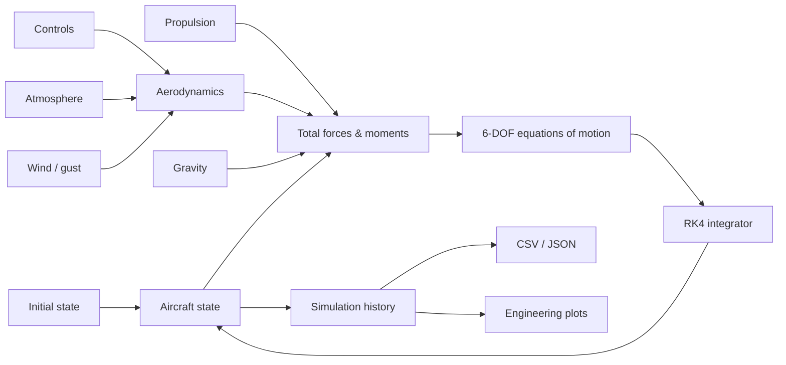

# Aircraft 6-DOF Flight Dynamics Simulator

> A from-scratch nonlinear rigid-body aircraft flight-dynamics simulator in Python, built around six-degree-of-freedom equations of motion, quaternion attitude propagation, aerodynamic force/moment buildup, atmosphere and wind models, numerical integration, verification tests, and reproducible engineering outputs.

[](https://github.com/ObedienceAdara/Aircraft-6-DOF-Equations-and-Coding/actions/workflows/core.yml)
[](https://www.python.org/)
[](https://numpy.org/)
[](LICENSE)

## Project overview

This repository implements a configurable six-degree-of-freedom (6-DOF) aircraft flight-dynamics model (FDM) rather than a pre-built black-box flight simulator. The purpose is to keep the equations, assumptions, force/moment models, numerical integration and generated results inspectable from source.

The formulation follows standard nonlinear rigid-body flight-dynamics practice. The primary formulation reference is Stevens, Lewis & Johnson, *Aircraft Control and Simulation*, 3rd ed. [1]. JSBSim is used as a useful open-source architecture/formulation comparison point, not as a runtime dependency. [2]

The included aircraft is deliberately generic. This is an engineering-oriented simulation framework and learning/research platform, not a validated digital twin of a particular aircraft.

---

## What is being simulated?

The simulator propagates a coupled translational/rotational aircraft state:

\[
\mathbf{x} =
\begin{bmatrix}
N & E & D & u & v & w & p & q & r & q_0 & q_1 & q_2 & q_3
\end{bmatrix}^{T}
\]

where `N/E/D` are local North-East-Down position coordinates, `u/v/w` are body-axis velocities, `p/q/r` are body angular rates, and `q0...q3` form the attitude quaternion.

The core equations are

\[
m(\dot{\mathbf v}+\boldsymbol\omega\times\mathbf v)=\mathbf F
\]

\[
\mathbf I\dot{\boldsymbol\omega}+\boldsymbol\omega\times(\mathbf I\boldsymbol\omega)=\mathbf M
\]

\[
\dot{\mathbf q}=\frac{1}{2}\mathbf q\otimes\begin{bmatrix}0&p&q&r\end{bmatrix}^{T}
\]

and aerodynamic loads are driven by relative air velocity:

\[
\mathbf V_{rel,NED}
=
\mathbf V_{aircraft,NED}
-\mathbf V_{wind,NED}
-\mathbf V_{gust,NED}.
\]

The air-data layer then derives airspeed `V`, angle of attack `alpha`, sideslip `beta`, dynamic pressure `qbar` and Mach number.

---

## Model architecture



The physical subsystems are intentionally separated so that individual models can be tested, replaced or increased in fidelity without rewriting the simulator.

### Core modules

| Module | Responsibility |
|---|---|
| `equations.py` | Nonlinear translational/rotational EOM and force/moment assembly |
| `state.py` | State, controls, geometry and environment definitions |
| `aero.py` | Aerodynamic coefficients, stability derivatives and loads |
| `propulsion.py` | Thrust and thrust-induced moments |
| `atmosphere.py` | Temperature, pressure, density and speed of sound |
| `gravity.py` | Normal-gravity approximation |
| `wind.py` | Deterministic gust and Dryden-style stochastic shaping |
| `mathutils.py` | Quaternion/DCM operations and attitude utilities |
| `frames.py` | Body/NED transformations |
| `integrators.py` | RK4 time integration |
| `simulation.py` | Time marching and state-history capture |
| `reporting.py` | Engineering data export and visualization |
| `actuators.py` | Rate/position-limited actuator primitives |
| `geodesy.py` | WGS-84 local geodetic utilities |

---

## Aerodynamic model

The aerodynamic model uses a coefficient-build-up approach driven by angle of attack, sideslip, body-rate derivatives and control-surface deflections.

Representative longitudinal terms are of the form

\[
C_L=C_{L0}+C_{L_\alpha}\alpha+C_{L_{\delta_e}}\delta_e+C_{L_q}\frac{qc}{2V}
\]

\[
C_D=C_{D0}+C_{D_{\alpha^2}}\alpha^2+C_{D_{\delta_e^2}}\delta_e^2.
\]

Lateral/directional behavior is represented through `CY`, `Cl` and `Cn` derivatives with respect to sideslip, angular rates and control surfaces.

The nondimensional coefficients are converted into dimensional loads using dynamic pressure, wing reference area, mean aerodynamic chord and span.

This makes the architecture suitable for progressively replacing the generic derivative set with data from CFD, DATCOM, wind-tunnel testing or flight-test identification.

---

## Atmospheric and disturbance models

The environment layer includes:

- standard-atmosphere temperature, pressure, density and speed of sound;
- normal gravity;
- steady NED wind;
- finite-duration one-minus-cosine gusts;
- a reproducible Dryden-style correlated stochastic turbulence process.

The project-level demonstration deliberately includes a scheduled gust so the disturbance can be traced through the chain:

```text
wind / gust
    ↓
relative air velocity
    ↓
alpha / beta / dynamic pressure / Mach
    ↓
aerodynamic coefficients
    ↓
forces / moments
    ↓
6-DOF aircraft response
```

The stochastic implementation is explicitly described as **Dryden-style**, not as a certification-grade implementation of MIL-F-8785C. MIL-F-8785C remains a useful historical flying-qualities reference, but the document is inactive and a reference to it is not a validation claim.

---

## Numerical method

The simulator uses classical fourth-order Runge-Kutta (RK4) integration. The attitude quaternion is renormalized after each step to control numerical drift.

Default project case:

```text
Simulation duration : 40.00 s
Integration step     : 0.02 s
Number of samples    : 2001
```

Run the complete case with:

```bash
python main.py
```

---

## Engineering results and visual diagnostics

A simulation run produces a complete machine-readable dataset and a visualization pack under `outputs/`:

```text
outputs/
├── simulation.csv
├── simulation_summary.json
├── flight_history.png
├── trajectory_3d.png
├── attitude.png
├── position_ned.png
├── velocity.png
├── angular_rates.png
├── aerodynamic_angles.png
├── aerodynamic_forces.png
├── aerodynamic_moments.png
├── control_inputs.png
├── atmospheric_state.png
├── wind_and_gust.png
├── propulsion.png
├── dynamic_pressure.png
├── mach_number.png
└── flight_path.png
```

### Technical plots

The output plots are intended as engineering diagnostics rather than decorative charts.

| Output | What it shows | Why it matters |
|---|---|---|
| `trajectory_3d.png` | 3-D North/East/Altitude trajectory | Overall translational response |
| `attitude.png` | Roll, pitch and yaw histories | Coupled rigid-body attitude response |
| `angular_rates.png` | `p`, `q`, `r` | Rotational dynamics and damping |
| `aerodynamic_angles.png` | `alpha`, `beta` | Aerodynamic operating condition |
| `aerodynamic_forces.png` | `Fx`, `Fy`, `Fz` | Force-model response and sign checks |
| `aerodynamic_moments.png` | `Mx`, `My`, `Mz` | Stability/control moment response |
| `control_inputs.png` | Aileron/elevator/rudder/throttle | Applied excitation/forcing history |
| `wind_and_gust.png` | Steady wind and gust components | Disturbance injection and timing |
| `dynamic_pressure.png` | \(\bar q=\frac12\rho V^2\) | Aerodynamic loading level |
| `mach_number.png` | Mach number | Compressibility/flight-regime indicator |
| `flight_path.png` | Flight-path angle | Climb/descent behavior |

A useful workflow is to inspect the disturbance, aerodynamic state, loads and aircraft response together rather than judging the trajectory alone.

> **Reproducibility note:** generated PNG/CSV/JSON artifacts are intentionally ignored by Git so a clone starts clean. For a formal experiment or portfolio case study, selected result plots should be copied into a versioned `docs/figures/` directory and tied to the exact model revision and case configuration that produced them.

---

## Example engineering questions the output can answer

Once the case has run, the exported data can be used to investigate questions such as:

- Does the aircraft respond in the expected direction to aileron, elevator and rudder inputs?
- Does the gust produce a measurable change in `beta` and lateral/directional loads?
- Do aerodynamic moments change consistently with the imposed control derivatives?
- Are the quaternion components remaining normalized?
- Are dynamic pressure and Mach number evolving consistently with airspeed and altitude?
- Does the aircraft remain numerically stable for the selected timestep?

These are model-verification questions, not evidence that the generic aircraft is physically representative of a real vehicle.

---

## Reproducible setup

### Windows

```powershell
python -m venv .venv
.venv\Scripts\activate
python -m pip install --upgrade pip
python -m pip install -r requirements.txt
python main.py
```

### Linux / macOS

```bash
python -m venv .venv
source .venv/bin/activate
python -m pip install --upgrade pip
python -m pip install -r requirements.txt
python main.py
```

Run the verification suite with:

```bash
pytest
```

No external flight-simulation engine is required by the canonical implementation.

---

## Verification vs. validation

A professional flight-dynamics workflow distinguishes **verification** from **validation**.

### Verification

Verification asks whether the software correctly implements the intended mathematics. The repository includes tests for items such as:

- DCM orthogonality and determinant;
- quaternion normalization;
- gravity-only behavior;
- zero-relative-speed aerodynamic behavior;
- deterministic gust timing and amplitude;
- reproducibility of the stochastic turbulence process;
- standard-atmosphere trends;
- deterministic RK4 behavior.

### Validation

Validation asks whether the mathematical model represents the physical aircraft/environment with adequate accuracy. That requires comparison against independent analytical solutions, published reference cases, another trusted FDM, wind-tunnel data, CFD, flight-test data or other appropriate evidence.

Passing the unit tests does **not** mean the aircraft model is validated.

See [`docs/VALIDATION.md`](docs/VALIDATION.md) for the current roadmap.

---

## Fidelity boundary

The current canonical model is a nonlinear rigid-body FDM with representative aerodynamic and propulsion parameters.

### Implemented

- six-degree-of-freedom rigid-body dynamics;
- local NED kinematics;
- quaternion attitude propagation;
- general inertia tensor handling;
- aerodynamic stability/control derivatives;
- dynamic pressure, Mach, angle-of-attack and sideslip calculations;
- thrust and thrust moment;
- atmosphere and gravity models;
- steady wind and deterministic gusts;
- Dryden-style stochastic shaping;
- RK4 integration;
- engineering data export and visualization;
- automated verification tests.

### Not yet a validated high-fidelity aircraft model

- full WGS-84 Earth rotation and transport-rate terms in the active EOM;
- aircraft-specific aerodynamic lookup tables over the full envelope;
- stall/post-stall aerodynamics;
- transonic/supersonic compressibility and wave-drag models;
- ground effect and unsteady aerodynamics;
- detailed engine/propeller performance maps;
- fuel burn and moving center of gravity;
- landing-gear/ground-contact dynamics;
- full actuator and sensor system simulation;
- trim and linearization tooling;
- validated flight-control laws;
- hardware-in-the-loop interfaces;
- reinforcement-learning environment wrappers.

These limitations are intentionally explicit so future fidelity upgrades can be measured rather than hidden.

---

## Repository structure

```text
.
├── main.py                    # Complete project-level simulation runner
├── pyproject.toml             # Package metadata and test configuration
├── requirements.txt           # Runtime/test dependencies
├── src/
│   └── aircraft6dof/          # Canonical FDM implementation
├── tests/                     # Verification tests
├── docs/
│   ├── ARCHITECTURE.md        # Software and physical architecture
│   ├── EQUATIONS.md           # Equations and sign/frame conventions
│   └── VALIDATION.md          # Verification/validation roadmap
└── outputs/                   # Generated local simulation results
```

The canonical tree contains one coherent FDM rather than separate tutorial/chapter implementations.

---

## Technical references

1. **Stevens, B. L., Lewis, F. L., & Johnson, E. N.** *Aircraft Control and Simulation: Dynamics, Controls Design, and Autonomous Systems*, 3rd ed., Wiley, 2015/2016. Primary reference for aircraft dynamics, control and simulation formulation.
   - https://onlinelibrary.wiley.com/doi/book/10.1002/9781119174882

2. **JSBSim Reference Manual.** Nonlinear 6-DOF flight-dynamics architecture and formulation reference.
   - https://jsbsim-team.github.io/jsbsim-reference-manual/
   - https://jsbsim-team.github.io/jsbsim-reference-manual/formulation/equations-of-motion-ii/

3. **U.S. Standard Atmosphere 1976**, NOAA/NASA/USAF/COESA. Reference atmosphere for temperature, pressure and density.
   - https://ntrs.nasa.gov/archive/nasa/casi.ntrs.nasa.gov/19770009539.pdf

4. **MIL-F-8785C**, *Flying Qualities of Piloted Airplanes*, 5 Nov 1980. Historical flying-qualities reference for future handling-quality work; listed as inactive by DLA ASSIST.
   - https://quicksearch.dla.mil/qsDocDetails.aspx?ident_number=7180

5. **NASA CR-1998-206937**, *Implementation and Testing of Turbulence Models for the F18-HARV Simulation*. Useful background for future full Dryden turbulence implementation and verification.

---

## Development roadmap

```text
Current
  │
  ▼
Nonlinear rigid-body 6-DOF FDM
  │
  ├── Aircraft-specific aerodynamic databases
  ├── Propulsion performance maps
  ├── Trim + linearization + stability analysis
  ├── Full turbulence / environmental models
  ├── Higher-order actuator and sensor models
  ├── Flight-control laws
  ├── Independent reference-case validation
  ├── RL / autonomy interfaces
  └── Hardware-in-the-loop / real-time execution
```

The engineering objective is straightforward: expose the physics, expose the assumptions, verify the implementation, then add fidelity in measurable layers.

---

## License

MIT License. See [`LICENSE`](LICENSE).
